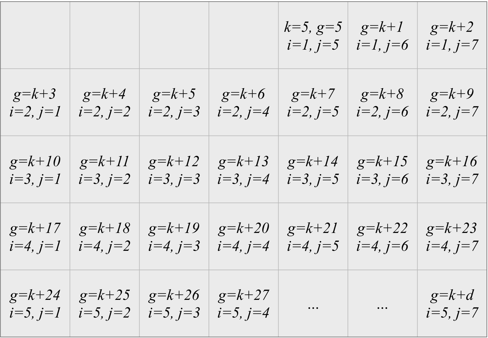

class: middle center

```{r initial, echo = FALSE, cache = FALSE, results = 'hide'}
library(knitr)
options(htmltools.dir.version = FALSE, tibble.width = 60)
opts_chunk$set(
  echo = FALSE, warning = FALSE, message = FALSE, comment = "#>",
  fig.path = 'figure/', cache.path = 'cache/', fig.align = 'center', 
  fig.width = 12, fig.height = 11, fig.show = 'hold', 
  cache = TRUE, external = TRUE, dev = 'svglite'
)
read_chunk('src/code.R')
```

background-image: url(img/sensor.png)
background-size: 55%

# .blue[Melbourne pedestrian activity]

---

.left-column[
## Pedestrian counting system
### - sensors
]
.right-column[
## The city of Melbourne
```{r sensor-map, fig.height = 9}
```
```{r theme-remark}
```
```{r selected-sensor, fig.show = "hide"}
```
]

---

.left-column[
## Pedestrian counting system
### - sensors
### - the data
]
.right-column[
* Sourced from [Melbourne open data portal](http://www.pedestrian.melbourne.vic.gov.au)
* Access the pedestrian data through the [rwalkr](http://pkg.earo.me/rwalkr/) package
* Up-to-date data till 2017-12-08
```{r ped-data}
```
```{r ped-print}
pedestrian
```
```{r ped-sub}
```
]

---

.left-column[
## Take a glimpse
### - selected sensors
]
.right-column[
* Southbank
* Southern Cross Station
* Victoria Market
```{r selected-sensor, fig.height = 9}
```
]

---

.left-column[
## Take a glimpse
### - selected sensors
### - time series plot
]
.right-column[
```{r ts-plot, echo = FALSE}
```
]

---

.left-column[
## Take a glimpse
### - selected sensors
### - time series plot
### - faceted display
]
.right-column[
```{r facet-time, echo = FALSE}
```
]

---

background-image: url(img/calendar.png)
background-size: cover

---

background-image: url(figure/sx-hol-1.svg)
background-size: cover

---

class: inverse middle center


## `r icon::fa_calendar()` calendar-based visualisation

---

.left-column[
## Calendar-based vis
### - construction
]
.right-column[
<center>
  
</center>

The grid position for any day in the month is given by

$$\begin{align}
i &= \lceil (g \mod 35) / 7\rceil \\ j &= g \mod 7.
\end{align}$$

Let $h$ and $c$ be the scaled hour and count, respectively, then the final
coordinates are given by:

$$\begin{align}
x &= j + h \\ y &= i - c.
\end{align}$$
]

---

.left-column[
## Calendar-based vis
### - construction
### - the args
]
.right-column[
### The `frame_calendar()` function

```r
frame_calendar(
  data, x, y, date, calendar = "monthly", dir = "h",
  sunday = FALSE, nrow = NULL, ncol = NULL, polar = FALSE,
  scale = "fixed", width = 0.95, height = 0.95
)
```
* `x`, `y`: a unquoted (or bare) variable mapping to x and y axis.
* `date`: a Date variable mapping to dates in the calendar.
* `calendar`: type of calendar. "monthly", "weekly", "daily".
* `sunday`: `FALSE` indicating to starting with Monday in a week, or `TRUE` for Sunday.
* `nrow`, `ncol`: number of rows and columns defined for "monthly" calendar layout.
* `scale`: "fixed", "free", "free_wday", and "free_mday".
]

---

.left-column[
## Calendar-based vis
### - construction
### - the args
### - usage
]
.right-column[
## Rearrange the data
```r
sx_cal <- pedestrian %>% 
  filter(Sensor == "Southern Cross Station") %>% 
* frame_calendar(x = Time, y = Count, date = Date)
```

```{r sx}
```
]

---

.left-column[
## Calendar-based vis
### - construction
### - the args
### - usage
]
.right-column[
## Initialise the plot with `ggplot2`
```r
p1_sx <- sx_cal %>% 
  ggplot(aes(x = .Time, y = .Count, group = Date)) +
  geom_line()
```
```{r sx-plot, fig.height = 9}
```
]

---

.left-column[
## Calendar-based vis
### - construction
### - the args
### - usage
]
.right-column[
## Add reference lines and labels
```r
prettify(p1_sx)
```
```{r sx-prettify, fig.height = 9.5}
```
]

---

.left-column[
## Calendar-based vis
### - construction
### - the args
### - usage
]
.right-column[
## Colour mapping as usual 
```r
p2_sx <- sx_cal %>%
  ggplot(aes(x = .Time, y = .Count, colour = Holiday, group = Date)) +
  geom_line()
prettify(p2_sx)
```
```{r sx-hol, fig.height = 9}
```
]

---

.left-column[
## Calendar-based vis
### - construction
### - the args
### - usage
]
.right-column[
## Zoom in to March
```{r sx-march}
```
]

---

.left-column[
## Calendar-based vis
### - construction
### - the args
### - usage
]
.right-column[
## Naturally work with the `group_by()`
```r
facet_cal <- subdat %>% 
  group_by(Sensor) %>% 
* frame_calendar(
*   x = Time, y = Count, date = Date, nrow = 2
* )

p_facet <- facet_cal %>% 
  ggplot(aes(x = .Time, y = .Count, group = Date)) +
  geom_line(aes(colour = Sensor)) +
  facet_grid(Sensor ~ .) +
  scale_colour_brewer(palette = "Dark2")
prettify(p_facet, label = NULL)
```
]

---

.left-column[
## Calendar-based vis
### - construction
### - the args
### - usage
]
.right-column[
## Faceted calendar plots
```{r facet}
```
]

---

## `r icon::fa_list()` Summary


* The full range of plotting capabilities in *ggplot2* is essentially available, from `geom_point()` to `geom_boxplot()`.
* Other language supports are made for month and weekday labels, like CJK.
* Patterns on special events for the region, like Anzac Day in Australia, or Thanksgiving Day in the USA, more easily pop out to the viewer as public holidays.
* This sort of layout will be useful for studying consumer trends, or human behavior, such as pedestrian patterns or residential electricity demand.

---

class: inverse middle center

# Joint work with [Di Cook](http://dicook.org) and [Rob J Hyndman](http://robjhyndman.com)

# Made with [`r icon::fa_heart()`]() and `r icon::fa_coffee()`

# Questions`r icon::fa_question()`
